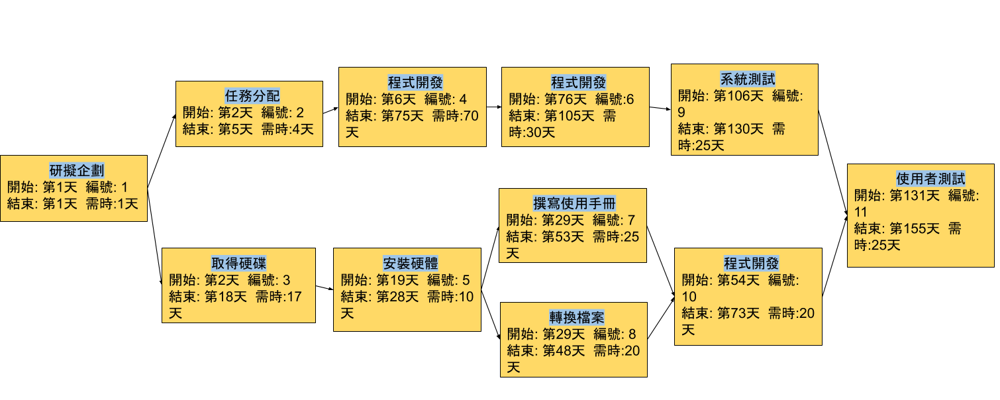
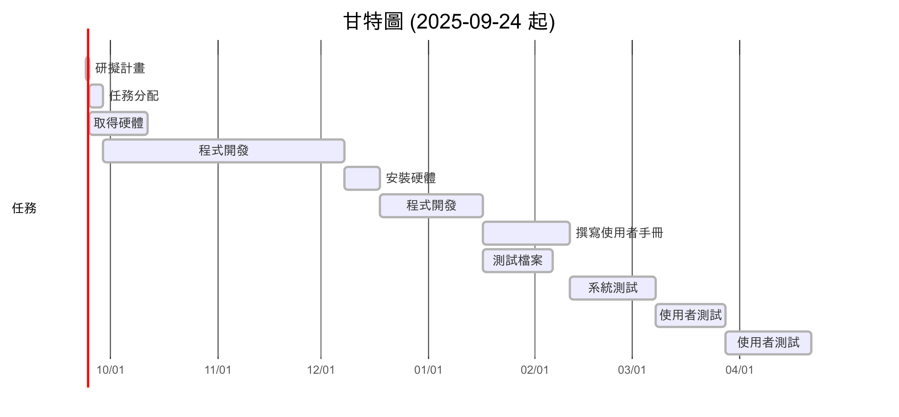

## 任務及任務模式
| 任務 |      說明      |          任務模式         |
|:----:|:--------------:|:------------------------:|
|  1   |    研擬計畫        |        多重後續         |
|  2   |    任務分配    |            依存          |
|  3   |    取得硬體    |           依存          |
|  4   |    程式開發    |      依存          |
|  5   |    安裝硬體    |    依存、多重後續     |
|  6   |    程式測試    |           依存          |
|  7   | 撰寫使用手冊   |         依存          |
|  8   |   轉換檔案     |          依存          |
|  9   |    系統測試    |        依存          |
| 10   |  使用者訓練    |   依存、多重前置     |
| 11   |  使用者測試    |    依存、多重前置     |

## 1. PERT/CPM 圖

## 2. 甘特圖

## 3. 關鍵路徑
1.研擬計畫 -> 2.任務分配 -> 4.程式開發 -> 6.程式測試 -> 9.系統測試 -> 11.使用者測試
